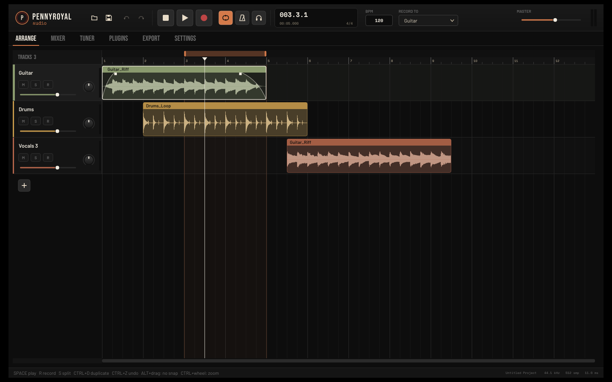
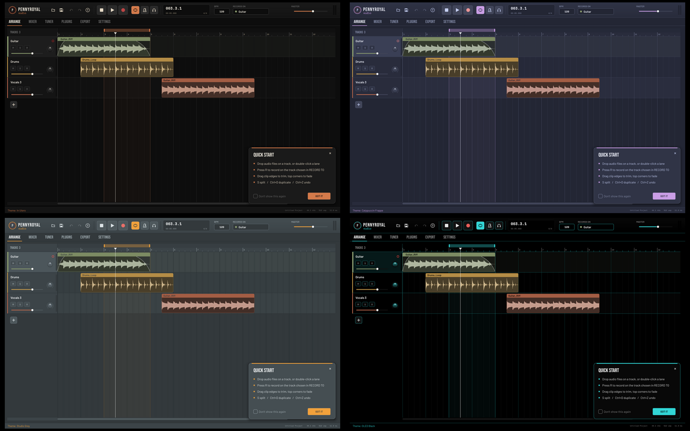
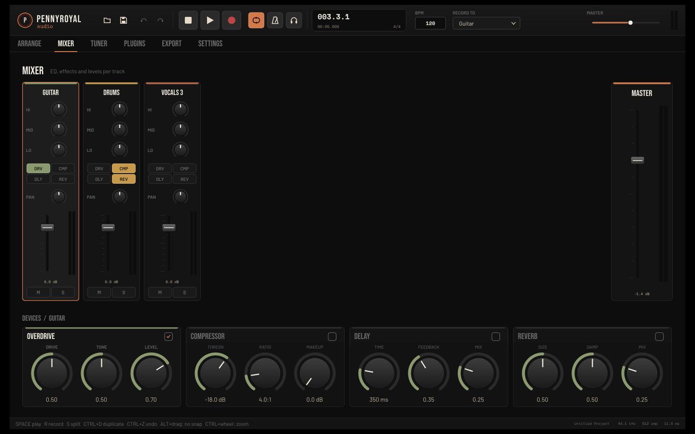

# Pennyroyal Audio

**DAW (Digital Audio Workstation) open-source hecho en C++17 con JUCE 8.**
Proyecto Final — EET N°24 "Simón de Iriondo", Resistencia, Chaco, Argentina.

Pennyroyal Audio es una estación de trabajo de audio gratuita y de código abierto,
pensada para músicos que no pueden (o no quieren) pagar licencias de DAWs comerciales.
Forma parte de un ecosistema que incluye un pedal de Overdrive analógico diseñado a medida.



## Funcionalidades

**Grabación y edición**
- Grabación y reproducción multipista: `R` graba en la pista armada o, si no hay ninguna, en la seleccionada
- La forma de onda se dibuja en vivo mientras grabás
- Monitoreo de entrada **a través de los efectos de la pista** (te escuchás con el overdrive, reverb, etc.)
- Importación de audio (WAV, MP3, AIFF, FLAC, OGG), también arrastrando archivos a la ventana
- Mover clips (incluso entre pistas) con imán a la grilla de compases
- Recortar clips, fade in / fade out, dividir (`S`), duplicar (`Ctrl+D`)
- Cortar, copiar, pegar y borrar clips
- Deshacer / rehacer ilimitado (`Ctrl+Z` / `Ctrl+Y`)
- Loop de reproducción con región arrastrable en la regla
- Metrónomo sincronizado al compás (acento en el tiempo 1)

**Mezcla y efectos**
- Mixer con faders, medidores, EQ de 3 bandas, paneo, mute y solo
- Rack de efectos por pista: **Overdrive** (modelado del pedal del proyecto), **Compresor**, **Delay** y **Reverb**
- Exportación a WAV 24 bits con todos los efectos aplicados

**Otros**
- Afinador cromático (algoritmo NSDF, A4 = 440 Hz)
- Guardar / abrir proyectos (`.pennyr`); las grabaciones se guardan como WAV junto al proyecto
- Escaneo de plugins VST3
- 4 temas visuales: **In Utero**, **Catppuccin Frappe**, **Studio Grey** y **OLED Black** (con color de contornos a elección)
- Interfaz en **español o inglés** (Ajustes → Idioma)
- Tarjeta de "Guía rápida" desactivable y tipografías propias embebidas





## Descarga

Los instaladores están en la sección **[Releases](../../releases)**:

| Sistema | Archivo |
|---|---|
| Windows 10/11 (64 bits) | `PennyRoyalAudioSetup.exe` |
| Cualquier Linux (Ubuntu, Fedora, Mint...) | `PennyRoyalAudio-x86_64.AppImage` |
| Ubuntu / Debian / Mint | `pennyroyal-audio_amd64.deb` |
| Otras distros (portable) | `pennyroyal-audio-linux.tar.gz` |

AppImage: darle permiso de ejecución (`chmod +x PennyRoyalAudio-x86_64.AppImage`) y abrirlo.
.deb: `sudo apt install ./pennyroyal-audio_amd64.deb`

## Atajos de teclado

| Tecla | Acción |
|---|---|
| `Espacio` | Play / Pausa |
| `R` | Grabar (pista armada o seleccionada) |
| `L` | Loop on / off |
| `S` | Dividir clip en el cursor |
| `Ctrl+D` | Duplicar clip |
| `Ctrl+X / C / V` | Cortar / copiar / pegar |
| `Supr` | Borrar clip |
| `Ctrl+Z` / `Ctrl+Y` | Deshacer / rehacer |
| `Ctrl+S` / `Ctrl+O` | Guardar / abrir proyecto |
| `Ctrl + rueda` | Zoom |
| `Alt + arrastrar` | Mover sin imán |

## Compilar desde el código

**Requisitos:** CMake 3.22+, un compilador C++17 y Git.
JUCE se descarga solo la primera vez que se configura el proyecto.

### Windows (CLion o Visual Studio)
1. Abrir la carpeta del proyecto en CLion (toolchain: Visual Studio).
2. Seleccionar el perfil **Release** y compilar (`Ctrl+F9`).
3. Instalador: abrir `packaging/windows/PennyroyalAudio.iss` con
   [Inno Setup](https://jrsoftware.org/isinfo.php) y presionar *Compile*.

### Linux
```bash
bash packaging/linux/build-linux.sh
```

## Tecnologías

C++17 · JUCE 8 · CMake · Inno Setup · CPack · GitHub Actions

Tipografías: Bebas Neue, Barlow, Space Mono (SIL Open Font License) y Special Elite (Apache 2.0).
Ver `Resources/Fonts/licenses`.

## Licencia

GNU General Public License v3.0 — ver `LICENSE`.
